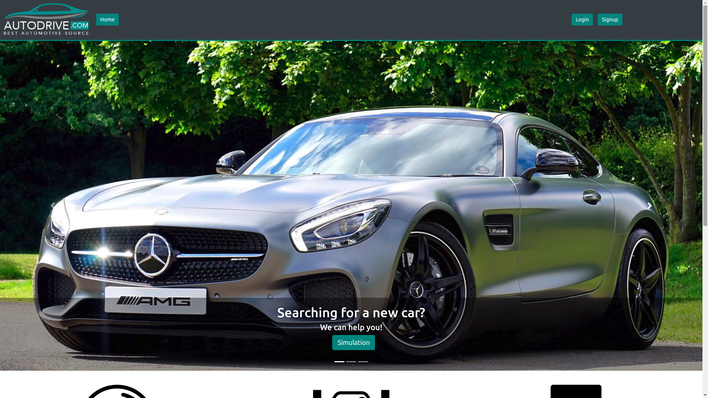

# Autodrive.com
-------------------------

Auonetodrive.com - Full-Stack Aplication
Autodrive.com is a plataform for those who want to know wich car is the best option for buying based on a serie of simple questions. It was developed as our final project at Ironhack's full stack course. This repository keeps the Front-end aplication developed in REACT (single-page-aplication), which is resposible for the user interface.

## Developers &  Version Control
-------------------------

Arthur Santoianni Barazzone Durant

Rafael Costa

## Acknowledgments
-------------------------

It was 3 weeks with a lot of work and dedication after almost 2 months bootcamping. Everybody at Ironhack's Sao Paulo has a huge participation on this achievement and we are very gratefull for all the support and for believe in our potential. :-)

Full-Stack carachteristics
Stack used in production: REACT, Axios & Bootstrap

Stack used during app development: Webpack, Sass, Babel (code compilers and transpilers)

APIs used: Our resourses based on carrosnaweb.com

Deployed at: Heroku

Link to the Aplication: [https://project-cars-app.herokuapp.com/]

Admin Credentials: login: arthur / password: 12345678

Prerequisites
No hardware prerequisites and no instalation needed. This aplication works 100% online and can be accessed in any device.

### Web instructions:
-------------------------

You should create account first, then you can log in to access you content. We provide a quick search for vehicle with a lot a real accessories, and info about prices, maintenance, depreciation in Brazil. You can use to compare with your country and know better how much cost to keep a car stopped in a garage. 

After that, press 'Start Simulation' button to begin the quiz for searching the best option for yourself. Check the result on the top button 'Best Cars'!

ADMIN Access: If you login with an ADMIN account, you will have some additiona access priviledges in your profile page. An ADMIN is able to create more cars to the databse. This makes the aplication fully functional since you can create new cars, add new categories and easily access and increase the quiz precision.

### Additional implementations and improvements:
-------------------------

Althouth the app is fully functional, improvements can be made to increase user's experience:

Please feel free to fork/clone this repo to look deeper into the logics of our app and contribute with some of the above improvements if you like :-) By forking this repo, use '$ npm install' in your terminal to add all dependencies needed and use '$ npm start' to initiate the app in your browser (webpack will automatically do this for you :=]).

